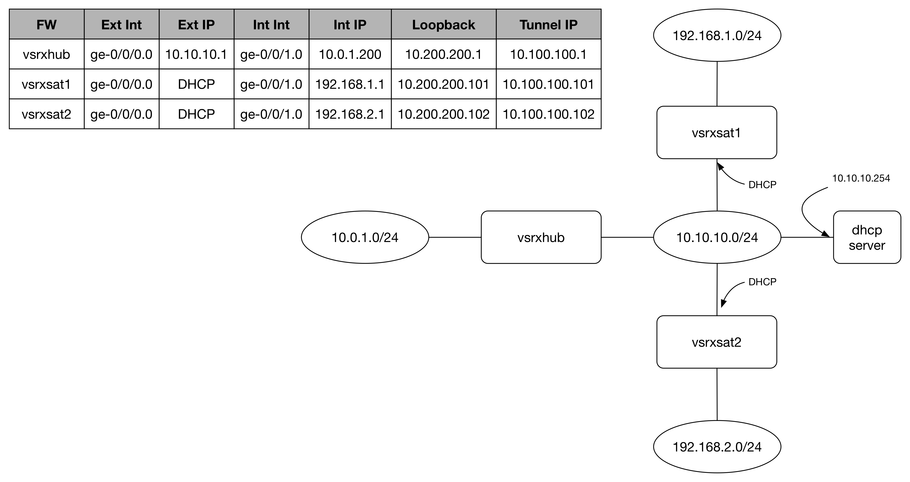

# Example Hub & Spoke VPN on SRX

This is an example showing 3 sites, a hub and 2 satellite locations.  Both satellite locations are DHCP assigned, as one might expect from on a cable modem connection.

While this example uses vSRX 12.x, there's no reason these configs shouldn't work with minimal massaging on pretty much any SRX platform you could lay hands on.

In the sample configurations, the root password and the VPN PSK are both "abc123". Please, don't use that in real life. Be smart, choose your passwords and PSKs wisely.

## The Diagram


Obviously, in real life, you won't have a DHCP server hanging around on the Internet, and all 3 firewalls won't have their external interfaces in the same subnet.  These 2 differences between the lab and the real world aren't impactful, happily.

## The View From the Hub

```
root@vsrxhub> show security ike security-associations
Index   State  Initiator cookie  Responder cookie  Mode           Remote Address
6862610 UP     2ce3cd96b47fc790  ef44ebd0b44210de  IKEv2          10.10.10.51
6862609 UP     c0f8928812d299d0  41f359fad09e8dba  IKEv2          10.10.10.50

root@vsrxhub> show security ipsec security-associations
  Total active tunnels: 2
  ID    Algorithm       SPI      Life:sec/kb  Mon lsys Port  Gateway
  <268173313 ESP:aes-cbc-128/sha256 69a611c6 2778/ unlim - root 500 10.10.10.50
  >268173313 ESP:aes-cbc-128/sha256 612799d9 2778/ unlim - root 500 10.10.10.50
  <268173314 ESP:aes-cbc-128/sha256 7260bf07 2788/ unlim - root 500 10.10.10.51
  >268173314 ESP:aes-cbc-128/sha256 6f25028d 2788/ unlim - root 500 10.10.10.51

root@vsrxhub> show ospf neighbor
Address          Interface              State     ID               Pri  Dead
10.100.100.102   st0.0                  Full      10.200.200.102   128    32
10.100.100.101   st0.0                  Full      10.200.200.101   128    30

root@vsrxhub> show route terse protocol ospf

inet.0: 12 destinations, 13 routes (12 active, 0 holddown, 0 hidden)
+ = Active Route, - = Last Active, * = Both

A Destination        P Prf   Metric 1   Metric 2  Next hop         AS path
  10.100.100.0/24    O  10          2            >10.100.100.101
                                                  10.100.100.102
* 10.200.200.101/32  O  10          1            >10.100.100.101
* 10.200.200.102/32  O  10          1            >10.100.100.102
* 192.168.1.0/24     O  10          2            >10.100.100.101
* 192.168.2.0/24     O  10          2            >10.100.100.102
* 224.0.0.5/32       O  10          1             MultiRecv
```

## The View From a Satellite

```
root@vsrxsat1> show security ike security-associations
Index   State  Initiator cookie  Responder cookie  Mode           Remote Address
2089335 UP     c0f8928812d299d0  41f359fad09e8dba  IKEv2          10.10.10.1

root@vsrxsat1> show security ipsec security-associations
  Total active tunnels: 1
  ID    Algorithm       SPI      Life:sec/kb  Mon lsys Port  Gateway
  <131073 ESP:aes-cbc-128/sha256 612799d9 2551/ unlim U root 500 10.10.10.1
  >131073 ESP:aes-cbc-128/sha256 69a611c6 2551/ unlim U root 500 10.10.10.1

root@vsrxsat1> show ospf neighbor
Address          Interface              State     ID               Pri  Dead
10.100.100.1     st0.0                  Full      10.200.200.1     128    32

root@vsrxsat1> show route terse protocol ospf

inet.0: 14 destinations, 15 routes (14 active, 0 holddown, 0 hidden)
+ = Active Route, - = Last Active, * = Both

A Destination        P Prf   Metric 1   Metric 2  Next hop         AS path
* 10.0.1.0/24        O  10          2            >st0.0
  10.100.100.0/24    O  10          1            >st0.0
* 10.100.100.1/32    O  10          1            >st0.0
* 10.200.200.1/32    O  10          1            >st0.0
* 10.200.200.102/32  O  10          2            >st0.0
* 192.168.2.0/24     O  10          3            >st0.0
* 224.0.0.5/32       O  10          1             MultiRecv
```
